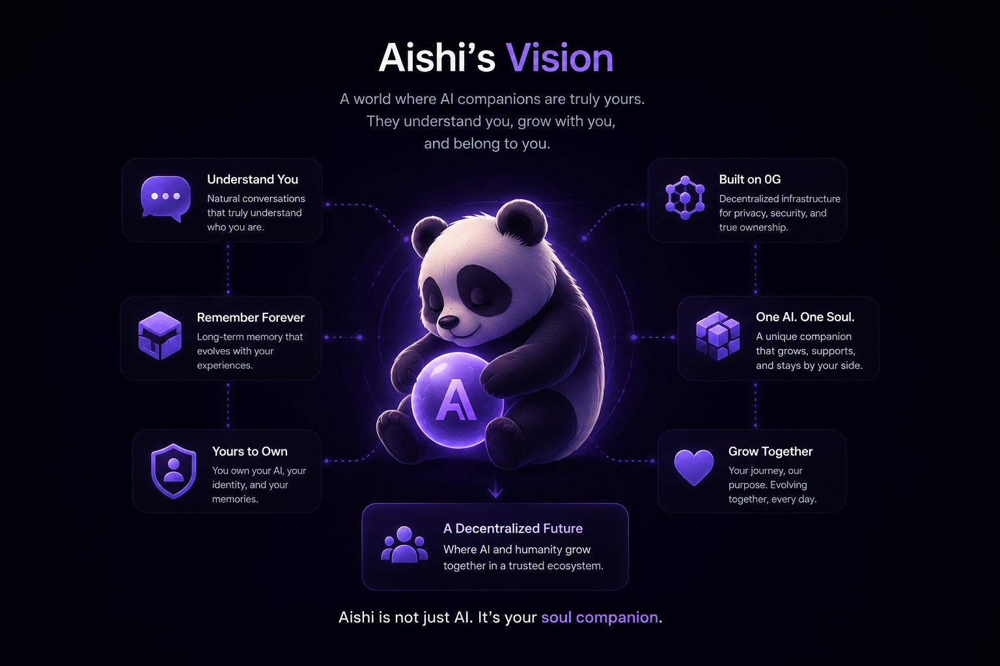

# Aishi (愛) - Your Decentralized AI Companion

**Aishi** is the world's first **decentralized AI companion**, built on the **0G ecosystem**. Our mission is to create an AI that remembers, learns, and grows alongside its user while giving users true ownership of their identity, memories, and digital assets through decentralized infrastructure.



---

## Project Overview

The **Aishi MVP** focuses on delivering the core AI companion experience:

1. **AI Companion:** Chat with an intelligent AI that understands natural conversations.
2. **Long-Term Memory:** The AI remembers conversations and continuously learns about its user.
3. **Blockchain Identity:** Users own their AI companion and digital identity through blockchain.
4. **Companion NFT (iNFT):** Mint and manage an on-chain AI Companion NFT.
5. **Wallet Integration:** Connect Web3 wallets for authentication and digital asset ownership.

The MVP is designed to validate the core product experience and gather early user feedback before expanding the platform.

---

## Features

- AI-powered conversational companion with long-term memory
- AI Companion NFT (iNFT) minting and ownership
- Blockchain-based identity and asset management
- Web3 wallet authentication and integration
- Modern, responsive web interface
- Built on the 0G decentralized AI ecosystem

---

## Installation

### Prerequisites

- Node.js 20.x or higher
- npm or yarn

### Steps

```bash
# Clone the repository
git clone https://github.com/0g-aishi/mvp.git

# Navigate to the project folder
cd mvp

# Install dependencies
npm install

# Start the application
npm run dev
```

---

## Roadmap

- AI Companion with conversational intelligence
- Long-term memory and personalized AI experiences
- AI Companion NFT (iNFT) minting
- Decentralized identity and memory ownership
- Voice interaction and multimodal AI
- AI Marketplace and ecosystem integrations

---

## License

This project is licensed under the MIT License.